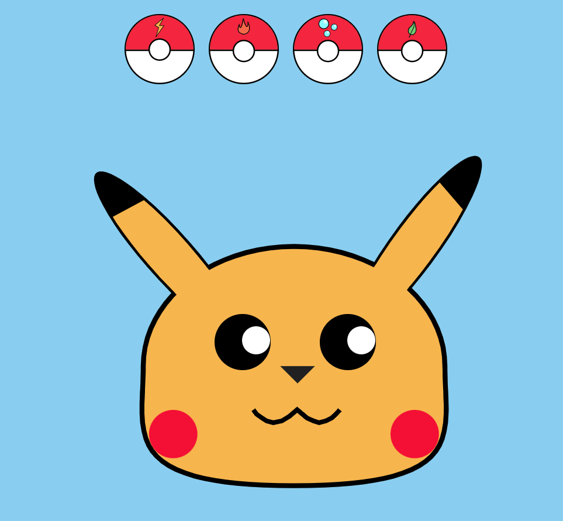

<div align="center" id="top">
     
</div>

# <h1 align="center">Eyes Movemente</h1>

<p align="center">
  <a href="#dart-description">Description</a> &#xa0; | &#xa0; 
  <a href="#dart-demo">Demo</a> &#xa0; | &#xa0;
  <a href="#memo-improvements">Improvements</a> &#xa0; | &#xa0;
  <a href="#art-technologies">Technologies</a> &#xa0; | &#xa0;
  <a href="#white_check_mark-requirements">Requirements</a> &#xa0; | &#xa0;
  <a href="#toolbox-installation">Installation</a> &#xa0; | &#xa0;
  <a href="#joystickhow-to-play">How to Play</a> &#xa0; | &#xa0;
  <a href="#briefcase-license">License</a> &#xa0; | &#xa0;
  <a href="https://github.com/arturomsoberanes" target="_blank">Author</a>
</p>

<br>


## :dart: Description ##

Eye movement is a project of week 8 of the MITXPRO "Full-Stack with MERN" certification, in this project you will be able to interact with a pokemon which will follow your mouse everywhere with its eyes, just like in the movies of terror where you feel that the paintings look at you.

## :dart: DEMO ##

If you want to try it just click [here](https://arturomsoberanes.github.io/Eyes-Movement)

## :memo: Improvements ##

These are the list of currect improvements:

- :diamonds: Add more Pokemons.	

## :art: Technologies ##

- [HTML](https://www.w3schools.com/html/)
- [CSS](https://www.w3schools.com/css/)
- [JavaScript](https://www.w3schools.com/js/)

## :white_check_mark: Requirements ##

Before starting :checkered_flag:, you need to have [Git](https://git-scm.com) installed.

## :toolbox: Installation ##

```bash
# Clone this project
$ git clone https://github.com/arturomsoberanes/Eyes-Movement.git
# Access to directory
$ cd Eyes-Movement
# Run index.html in a browser
```

## :joystick:	How to Play ##

Open index.html and you can see four Pokeballs
- Choose your initial Pokemon
- And this pokemon will see with the eyes your mouse everywhere


## :briefcase:	 License ##

This project is under license from MIT. For more details, see the [LICENSE](LICENSE) file.


Made with :heart: by <a href="https://github.com/arturomsoberanes" target="_blank">Arturo Soberanes</a>

&#xa0;

<a href="#top">Back to top</a>
